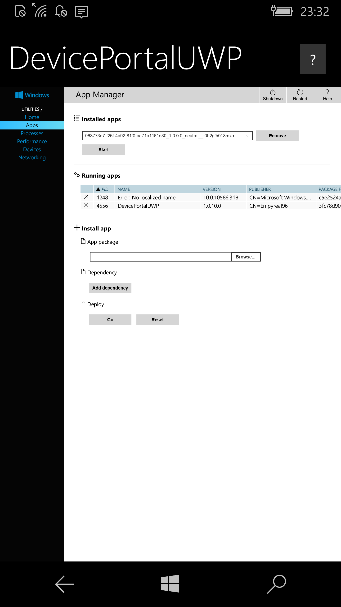
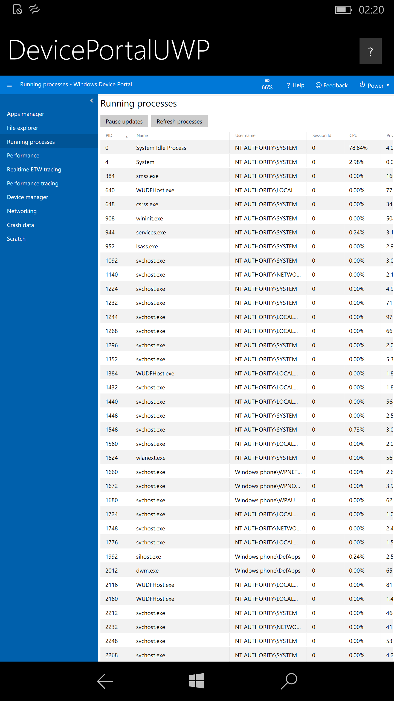

# DevicePortalUWP for Windows 10 Mobile


## What is it?

It is a simple 'Wrapper' for Device Portal using WebView components for Windows 10 Mobile ARM build 10240 to 16212.


### Details

- Connects to "http://127.0.0.1" (localhost)

- Device Portal needs to be *enabled* in Windows Settings

- Authentication is supported

- Built with VS2019

- No special requirements for 10586 and below

  

## Requirements for 14393+

- Interop Unlocked
- Disable Windows Firewall, import this [registry file](assets/Disable_Firewall.reg) in Interop Tools (Use [this](assets/Enable_Firewall.reg) if you ever need to re-enable Firewall)

# Current Changes

```
- Inital public upload
```


